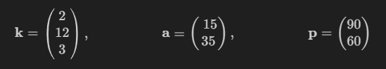

## Aufgabe 3

Eine Fabrik stellt aus drei Rohstoffen $R_1$, $R_2$ und $R_3$ zwei Endprodukte $E_1$ und $E_2$ her. Die untenstehende Tabelle gibt an, wieviele Mengeneinheiten (ME) der Rohstoffe zur Herstellung je einer Mengeneinheit eines Endproduktes benötigt werden.

|       | $E_1$ | $E_2$ |
| ----- | ----- | ----- |
| $R_1$ | 1     | 4     |
| $R_2$ | 0     | 6     |
| $R_3$ | 4     | 2     |

Des Weiteren sind der Vektor der Stückkosten $k$ für die Rohstoffe in Euro/ME, der Vektor der Produktionsmengen zum Auftrag a der Endprodukte und in ME, sowie der Vektor der Verkaufspreise p für die Endprodukte und in Euro/ME wie folgt gegeben:

$$\textbf{k}=\begin{pmatrix} 2 \\ 12 \\ 3 \end{pmatrix}, \quad\qquad\qquad \textbf{a}= \begin{pmatrix}  15 \\ 35 \end{pmatrix}, \quad\qquad\qquad\textbf{p}=\begin{pmatrix} 90 \\ 60 \end{pmatrix}$$

Bestimmen Sie wahre Aussagen zu obenstehendem Sachverhalt:

| Teil | Lösung | Aussage                                                                                                                                                                               |
| ---- | ------ | ------------------------------------------------------------------------------------------------------------------------------------------------------------------------------------- |
| A    | X      | Die gesamten Rohstoffkosten für alle Endproduktmengen von Auftrag $a$ betragen insgesamt 3220 Euro.                                                                                   |
| B    | X      | Zur Herstellung des Auftrags $a$ der Endprodukte ergibt sich als Vektor der dafür erforderlichen Rohstoffe in ME: $$\left(R_1,\,R_2,\,R_3\right)^T=\left(155,\, 210, 130\right)^T$$   |
| C    | -      | Zur Herstellung des Auftrags der Endprodukte und ergibt sich als Vektor der dafür erforderlichen Rohstoffe in ME: $$\left(R_1,\,R_2,\,R_3\right)^T=\left(155,\, 130,\, 210\right)^T$$ |
| D    | X      | Der Erlös des Auftrags a beträgt 3450 Euro.                                                                                                                                           |
| E    | -      | Die Rohstoffkosten für 20 Mengeneinheiten des Endproduktes $E_1$ betragen 340 Euro.                                                                                                   |

---

### Unteraufgabe A

#### Aufgabe:

Die gesamten Rohstoffkosten für alle Endproduktmengen von Auftrag $a$ betragen insgesamt 3220 Euro.

#### Überlegungen:

Man könnte die Kosten für eine Produktmenge errechnen und dann mit der Gesamtauftragsmenge multiplizieren.

#### Berechnung

**Kosten Endprodukte**

Kosten $E_1$: $1*2 + 4*3 = 14$\
Kosten $E_2$: $4*2 + 6*12 + 2*3 = 86$

Gesamtkosten: $15*E_1 + 35*E_2 = 15*14 + 35*86 = 3220$

Die Aussage ist also wahr.

---

### Unteraufgabe B

#### Aufgabe:

Zur Herstellung des Auftrags $a$ der Endprodukte ergibt sich als Vektor der dafür erforderlichen Rohstoffe in ME: $\left(R_1,\,R_2,\,R_3\right)^T=\left(155,\, 210, 130\right)^T$

#### Überlegungen:

Gesucht scheint ja einfach nur die benötigte Gesamtmenge aller Rohstoffe zu sein. In dem Fall müsste man einfach nur den Gesamt-Materialbedarf von jeweils $E_1$ und $E_2$ ermitteln, indem die Rohstoffmengen zur Auftrags-Menge multipliziert wird und dann summiert wird.

#### Berechnung:

**Rohstoff-Vektoren**

$e_1$ = $\left(1,\,0,\,4\right)^T$\
$e_2$ = $\left(4,\,6,\,2\right)^T$

**Multiplizieren mit Auftrags-Mengen**

$e_1 * 15$ = $\left(15,\,0,\,60\right)^T$\
$e_2 * 35$ = $\left(140,\,210,\,70\right)^T$

**Summieren der Vektoren**

$\left(15,\,0,\,60\right)^T + \left(140,\,210,\,70\right)^T = \left(155,\,210,\,130\right)^T$

Die Aussage ist also wahr

---

### Unteraufgabe C

#### Aufgabe:

Zur Herstellung des Auftrags der Endprodukte und ergibt sich als Vektor der dafür erforderlichen Rohstoffe in ME: $\left(R_1,\,R_2,\,R_3\right)^T=\left(155,\, 130,\, 210\right)^T$

#### Überlegungen:

Die Aussage ist falsch, siehe B

---

### Unteraufgabe D

#### Aufgabe:

Der Erlös des Auftrags a beträgt 3450 Euro.

#### Überlegungen:

Erlös errechnet sich einfach aus der Auftragsmenge * Verkaufspreise.

#### Berechnung

Erlös $E_1$: $15*90 = 1350$\
Erlös $E_2$: $35*60 = 2100$

Erlös gesamt: $1350 + 2100 = 3450$

Die Aussage ist also wahr.

---

### Unteraufgabe E

#### Aufgabe:

Die Rohstoffkosten für 20 Mengeneinheiten des Endproduktes $E_1$ betragen 340 Euro.

#### Überlegungen:

Aus A wissen wir, dass die Kosten von $E_1$: $1*2 + 4*3 = 14$ betragen, d.h. 20 Einheiten von $E_1$ hätten Rohstoffkosten in Höhe von $14 * 20 = 280$.

Die Aussage ist daher falsch.