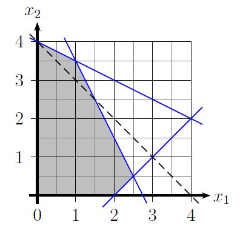
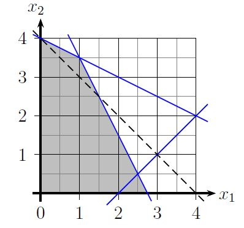
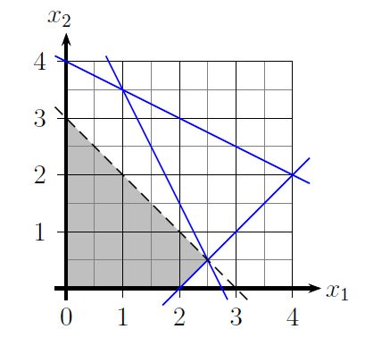
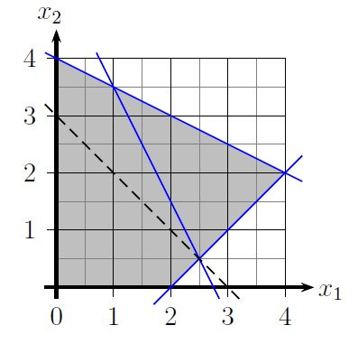
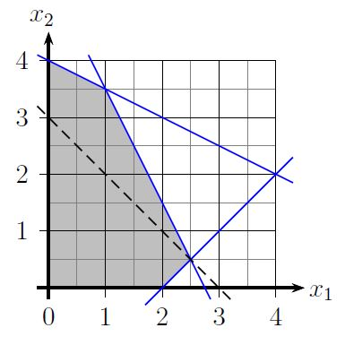
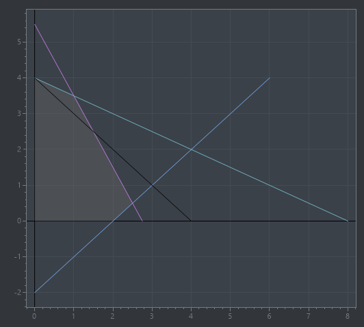

## Aufgabe 6

Bestimmen Sie die Grafiken, die die folgende Planungsaufgabe korrekt darstellen:

|        |     |     |                  |     |              |        |      |         |
| ------ | --- | --- | ---------------- | --- | ------------ | ------ | ---- | ------- |
| max    | $1$ | $+$ | $x_1$            | $+$ | $x_2$        |        |      |         |
| u.d.N. |     |     | $x_1$            | $-$ | $x_2$        | $\leq$ | $2$  | $(1)$   |
|        |     |     | $4x_1$           | $+$ | $2x_2$       | $\leq$ | $11$ | $(2)$   |
|        |     |     | $\frac{1}{2}x_1$ | $+$ | $x_2$        | $\leq$ | $4$  | $(3)$   |
|        |     |     |                  |     | $x_1$, $x_2$ | $\geq$ | $0$  | $(NNB)$ |

A:



B:



C:



D:



E:



---

### Überlegungen

Zum Verständnis macht es wahrscheinlich Sinn, das LOP selbst graphisch zu lösen und dann zu vergleichen

**Umwandlung der Ungleichungen der NB in Gleichungen**

(1): $x_1 - x_2 = 2$\
(2): $4x_1 + 2x_2 = 11$\
(3): $\frac{1}{2}x_1 + x_2 = 4$

**Auflösen der Gleichungen nach $x_1$ und $x_2$**

Nach $x_1$:

(1) $x_1 = 2 + x_2$\
(2) $x_1 = \frac{11 - 2x_2}{4}$\
(3) $x_1 = 8 - 2x_2$

Nach $x_2$:

(1) $x_2 = x_1 - 2$\
(2) $x_2 = \frac{11 - 4x_1}{2}$\
(3) $x_2 = 4 - \frac{1}{2}x_1$


**Schnittpunkte mit den Achsen bestimmen**

$x_1 = 0$:

(1) $0 = 2 + x_2 \Leftrightarrow x_2 = -2$\
(2) $0 = \frac{11 - 2x_2}{4} \Leftrightarrow x_2 = \frac{11}{2}$\
(3) $0 = 8 - 2x_2 \Leftrightarrow x_2 = 4$

$x_2 = 0$:

(1) $0 = x_1 - 2 \Leftrightarrow x_1 = 2$\
(2) $0 = \frac{11 - 4x_1}{2} \Leftrightarrow x_1 = \frac{11}{4}$\
(3) $0 = 4 - \frac{1}{2}x_1 \Leftrightarrow x_1 = 8$

**Geraden ermitteln**

(1) $x_1 = 2, x_2 = -2$\
(2) $x_1 = \frac{11}{4}, x_2 = \frac{11}{2}$\
(3) $x_1 = 8, x_2 = 4$

Lösungsräume befinden sich wegen $\leq$ immer unterhalb der Gleichungen

**Zielfunktion auflösen**

$1 + x_1 + x_2 = 0$\
Nach $x_2$: $x_2 = - x_1 - 1$

Beliebigen Wert für $x_2$ wählen, z.B. 3\
Dann ergibt sich:

$3 = - x_1 - 1 \Leftrightarrow 4 = - x_1$

D.h. um die Zielfunktion zu zeichnen würde man beim Punkt (0,4) starten und von da aus eine Linie in der gegebenen Steigung -1 einzeichnen (also z.B. 1 nach rechts, eins nach unten, Punkt (1,3)). 


### Zeichnen von Plot



<details>
<summary>Code</summary>

```csharp

#r "nuget:ScottPlot, 4.1.69"

using System.Drawing;
using ScottPlot.Drawing;
using ScottPlot.Plottable;
using Microsoft.DotNet.Interactive.Formatting;

Formatter.Register(typeof(ScottPlot.Plot), (p, w) => 
    w.Write(((ScottPlot.Plot)p).GetImageHtml()), HtmlFormatter.MimeType);

// restriktionen:
var r1X = new double[] {6, 0};
var r1Y = new double[] {4, -2};
var r2X = new double[] {11.0/4.0, 0};
var r2Y = new double[] {0, 11.0/2.0};
var r3X = new double[] {8, 0};
var r3Y = new double[] {0, 4};

// maximierungsfunktion:
var maxX = new double[] {0, 4};
var maxY = new double[] {4, 0};

var plot = new ScottPlot.Plot(550, 500);
plot.Palette = ScottPlot.Palette.OneHalfDark;
plot.Style(ScottPlot.Style.Gray1);
plot.AddHorizontalLine(0, Color.Black);
plot.AddVerticalLine(0, Color.Black);

var resultX = new double[] {0, 2, 2.5, 1, 0};
var resultY = new double[] {0, 0, 0.5, 3.5, 4};
plot.AddPolygon(resultX, resultY, fillColor: Color.FromArgb(90, Color.DimGray));

plot.AddScatterLines(r1X, r1Y);
plot.AddScatterLines(r2X, r2Y);
plot.AddScatterLines(r3X, r3Y);

plot.AddScatterLines(maxX, maxY, Color.Black);

plot

```

</details>